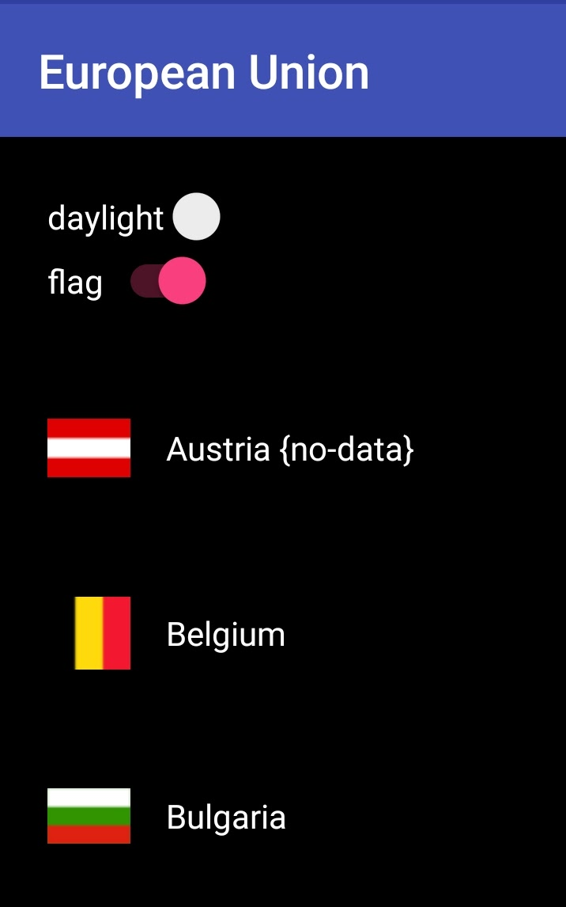

# ModelViewViewModel (MVVM)

This time we are making two viewModels. One is for the app styling, and another one is for countries.

`AppViewModel` provides two properties.
*   dayMode: shows the activity in day or night mode.
*   show-flags: display flags in the RecyclerViewList, or the WikiActivity

`CountryViewModel`
*   Has a list of countries.
*   Each country is now extending to `BaseObservable`.
    * properties are using native observables such as ObservableInt
*   Instead of providing the selected country from an intent extra to the second activity. We are referencing it through `countrySelected`

 Here are a few things I learned while doing this demo.

 *  We cannot update the theme dynamically. It happens before building an activity; therefore, we can finish and restart the activity.
 *  We also cannot update styles at runtime. So now there is a `service/ThemeAdapter` which provides adapters to change background and text color at runtime.
 *  If we were to keep AppViewModel members not being observables then we had to reset the binding for each change to any of them. `binding.setAppViewModel(appViewModel);`
 *  Since this demo doesn't do that. It is simpler to just do `viewModel.member.set(value)`
 *  Using `ListObservables` seem like a lot of work, so I just kept countries as part of `List<Country>`. :)
 *  Android-Databinding is one way. Meaning the binding works for getters, but for setters you are required to either use any way of listening to changes and then applying them to the viewModel. `MainActivity` implements `AppViewListener` and in that way it is able to get update calls from the layout. `android:onCheckedChanged="@{appViewListener.setDayMode}"`

So here our daylight switch is on, and so is our show-flags switch.

